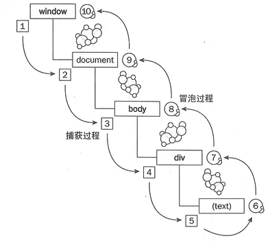

# 事件捕获和事件冒泡

::: info 概念
事件冒泡和事件捕获分别由微软和网景公司提出，这两个概念都是为了解决页面中事件流（事件发生顺序）的问题。
:::

```html
<div id="outer">
  <div id="inner">点我</div>
</div>
```

> 上面的代码当中一个 outer 元素当中有一个 inner 元素，如果两个元素都有一个 click 的处理函数，那么我们怎么才能知道哪一个函数会首先被触发呢？

## 事件冒泡

微软提出了名为事件冒泡(event bubbling)的事件流。事件冒泡可以形象地比喻为把一颗石头投入水中，泡泡会一直从水底冒出水面。也就是说，事件会从最内层的元素开始发生，一直向上传播，直到 document 对象。

因此上面的例子在事件冒泡的概念下发生 click 事件的顺序应该是

inner -> outer -> body -> html -> document

## 事件捕获

网景提出另一种事件流名为事件捕获(event capturing)。与事件冒泡相反，事件会从最外层开始发生，直到最具体的元素。

上面的例子在事件捕获的概念下发生 click 事件的顺序应该是

document -> html -> body -> outer -> inner

## 事件冒泡和事件捕获过程图：



1-5 是捕获过程，5-6 是目标阶段，6-10 是冒泡阶段；

## addEventListener 的第三个参数

```js
 element.addEventListener(event, function, useCapture)
```

| 参数 | 描述                                                         |
| -------- | ------------------------------------------------------------ |
| event       | 必须。字符串，指定事件名。<br/>**注意**: 不要使用 "on" 前缀。 例如，使用 "click" ,而不是使用 "onclick"。 <br/>**提示**： 所有 HTML DOM 事件，[可以查看完整的 HTML DOM Event 对象参考手册](https://www.runoob.com/jsref/dom-obj-event.html)。|
| function       | 	必须。指定事件触发时要执行的函数。<br/>事件对象会作为第一个参数传入函数。 事件对象的类型取决于特定的事件。例如，"click" 事件属于 MouseEvent(鼠标事件) 对象。 |
| useCapture      | 可选。布尔值，指定事件是在捕获还是冒泡阶段执行。<br/>可能值:<br/>true - 事件句柄在捕获阶段执行（即在事件捕获阶段调用处理函数）<br/>false -  默认。事件句柄在冒泡阶段执行（即表示在事件冒泡的阶段调用事件处理函数） |

## 事件捕获先于事件冒泡触发

```html
<div id="outer">
  <div id="inner">点我</div>
</div>

<script>
  const outer = document.getElementById('outer');
  const inner = document.getElementById('inner');

  outer.addEventListener('click',function (e) {
      console.log('外部冒泡');
    },
    false
  );

  inner.addEventListener('click',function (e) {
      console.log('内部冒泡');
    },
    false
  );

  inner.addEventListener('click',function (e) {
      console.log('内部捕获');
    },
    true
  );

  outer.addEventListener('click',function (e) {
      console.log('外部捕获');
    },
    true
  );
</script>
```
我点击 inner 元素，打印顺序为:`外部捕获->内部捕获->内部冒泡->外部冒泡`

开发中事件冒泡使用较多，比如事件代理，就用到了事件冒泡。

