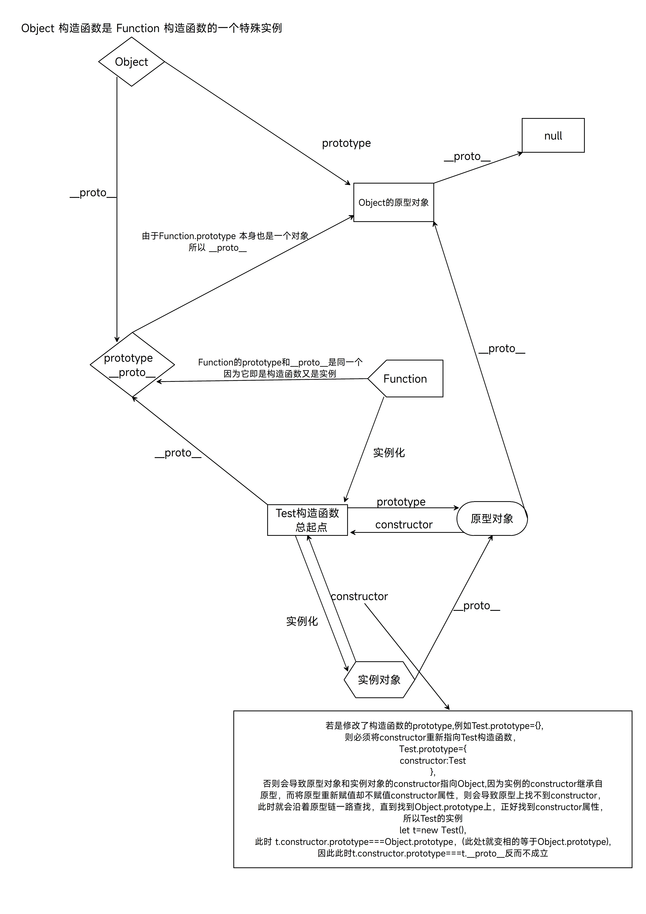

# 搞清楚原型链以及原型链中的 Function 和 Object

::: info 鸡蛋问题
此处涉及到到底是先有 Object 还是先有 Function,我的看法是 Function 先于 Object

:::

## 原型&&原型链

```javascript
//构造函数
function Test() {
  this.a = 1;
}

//Test构造函数的原型对象会有一个原型链，那么他的__proto__就会指向指向Object.prototype
console.log(Test.prototype.__proto__ === Object.prototype);
//而Object的原型对象的__proto__已经到顶了，所以指向null
console.log(Object.prototype.__proto__); //null

// Function Object 函数 对象
//Test构造函数说白了是一个Function的实例对象，根据构造函数，实例对象，原型对象的三角关系，此时Test.__proto__ === Function.prototype就完全成立
console.log(Test.__proto__ === Function.prototype);

//此处是因为Function即是构造函数，也是Function的实例对象，所以Function.__proto__ === Function.prototype就完全成立
console.log(
  Function.__proto__ === Function.prototype,
  'Function.__proto__ === Function.prototype'
);

//因为Function.prototype是对象，所以它也有__proto__属性，因此就指向Object.prototype
console.log(Function.prototype.__proto__);
console.log(Function.prototype.__proto__ === Object.prototype);

//因为Object是构造函数，也是Function的实例对象，所以Object.__proto__ === Function.prototype就完全成立
console.log(
  Object.__proto__ === Function.prototype,
  'Object.__proto__ === Function.prototype'
);

//又因为Function.__proto__ === Function.prototype，所以Object.__proto__ === Function.__proto__就完全成立
console.log(
  Object.__proto__ === Function.__proto__,
  'Object.__proto__===Function.__proto__'
);
```

## 原型链图例


