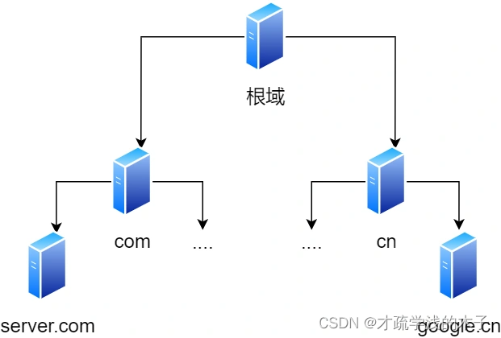
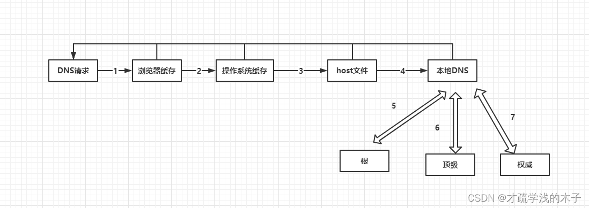

# DNS 查询流程

查询服务器域名对应的 IP 地址 
其中域名的层级关系类似于一个树状结构

- 根域名服务器(.)
- 顶级域名服务器(.com)
- 权威域名服务器(server.com)

## 域名解析工作流程

1. 客户端发起一个 DNS 请求，先查看本地浏览器是否有这个域名的缓存，有解析结束
2. 没有则去看操作系统是否有缓存，有解析结束
3. 没有则去看本地 host 文件，有解析结束
4. 没有则发送该请求到本地 DNS 服务器，如果本地 DNS 服务器存在则返回
5. 不存在于本地 DNS 服务器则请求根域名服务器，比如请求`www.baidu.com`,如果`www.baidu.com`的解析结果不存在于本地 DNS 服务器的缓存中，‌ 则会向根域名服务器发起请求。‌ 根域名服务器收到请求后，‌ 会告诉本地 DNS 服务器负责`.com`顶级域名的服务器的地址。‌
6. 本地 DNS 服务器收到顶级域名（‌.com）服务器的位置后，‌ 会向该顶级域名服务器请求`www.baidu.com`的权威域名服务器的地址。‌ 顶级域名服务器收到请求后，‌ 会告诉本地 DNS 服务器负责`www.baidu.com`的权威域名的服务器的地址。‌
7. 本地 DNS 服务器再向权威 DNS 服务器发起请求，权威 DNS 服务器查询后将对应的 IP 地址告诉本地 DNS
8. 本地 DNS 服务器缓存该域名与对应 IP 然后返回 IP 给客户端
9. 浏览器根据 TTL 缓存该值

> 注意：其中 1-4 为递归查询，5-7 为迭代查询

> 一旦在本地 DNS 服务器中未查询到对应的地址，则会一路查询到权威 DNS 服务器
