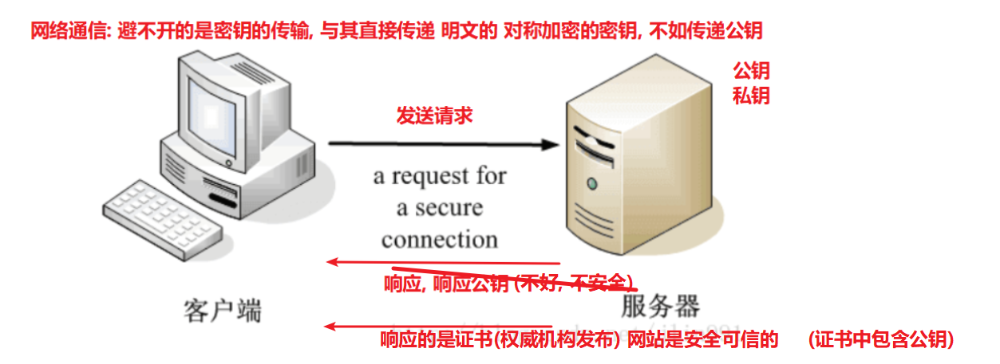

# HTTPS 协议

## 1. 什么是 HTTPS 协议？

超文本传输安全协议（Hypertext Transfer Protocol Secure，简称：HTTPS）是一种通过计算机网络进行安全通信的传输协议。HTTPS 经由 HTTP 进行通信，利用 SSL/TLS(安全传输层协议) 来加密数据包。HTTPS 的主要目的是提供对网站服务器的身份认证，保护交换数据的隐私与完整性。

> 当客户端（如浏览器）尝试通过 HTTPS 与服务器建立连接时，服务器会发送其 SSL/TLS 证书给客户端。客户端会验证这个证书的有效性以及证书中的域名是否与正在尝试连接的服务器域名匹配，如果验证成功，客户端就可以确信它正在与正确的服务器进行通信。 
> 即：该身份认证主要指对服务器进行身份认证

## 2. 为什么需要 HTTPS？

HTTP 协议是网络通信的基石, 基于 HTTP 协议, 完成了很多的网页应用功能, 但是 HTTP 协议是明文传输数据的! 太不安全了!

HTTPS 是安全版的 HTTP。

HTTP 协议在传输数据时采用的是明⽂方式传递，因此，⼀些敏感信息的传输就变得很不安全。

而 HTTPS 就是为了解决 HTTP 的不安全⽽产⽣的。

## 3. HTTPS 是如何保证安全的？

::: warning 注意
公钥在加密通信中主要扮演两个角色：‌ 一是加密客户端生成的会话密钥，‌ 确保只有持有私钥的服务器能够解密并获取会话密钥；‌ 二是解密证书签名，‌ 以验证证书内容的真实性。‌ 公钥不用于直接加密或解密机密信息，‌ 因为它是公开的，‌ 任何人都可以使用此公钥解密信息，‌ 这会导致安全隐患。‌ 后续的交流主要依靠对称加密来完成，‌ 这种方式既快速又安全，‌ 能够有效地保护传输的数据不被未经授权的访问或泄露。‌
:::

HTTPS 在传输数据的过程中会对数据进行加密处理，保证安全性。

那 HTTPS 采用的什么样的加密方式呢？我们来了解下一些加密的基本概念。

目前常见的加密算法可以分成三类，`对称加密算法`，`非对称加密算法` 和 `Hash算法`。

1. 对称加密算法: 相同密钥加密解密, 可逆的! 可以用于加密解密传输数据

   想使用对称加密算法, 一定要保证密钥不被泄漏 (且进行密钥的传输约定时, 一定要保证安全)

2. 非对称加密算法: 有两把钥匙, 公钥, 私钥, 可逆的, 可以用于 https 的初步交换密钥

3. Hash 算法: 不可逆的, 根据一段内容, 生成一段唯一标识, 一般用于验证数据是否被修改! (md5)

### 3.1 **什么是对称加密？**

对称加密的特点是文件加密和解密使用相同的密钥，即加密密钥也可以用作解密密钥，

这种方法在密码学中叫做对称加密算法，对称加密算法使用起来简单快捷，密钥较短，且破译困难

**通信的双⽅都使⽤同⼀个秘钥进⾏加密, 解密。**⽐如，两个人事先约定的暗号，就属于对称加密。

对称加密的特点是：

- 优点:

  计算量小、加密速度快、加密效率高。

- 缺点:

  **在数据传送前，发送方和接收方必须商定好秘钥，然后双方保存好秘钥。**

  **如果一方的秘钥被泄露，那么加密信息也就不安全了**

  最不安全的地方, 就在于第一开始, 互相约定密钥的时候!!! 传递密钥!

使用场景：本地数据加密、https 通信、网络传输等

常见算法：AES、DES、3DES、DESX、Blowfish、IDEA、RC4、RC5、RC6 (全球公开, 通过了层层筛选, 层层检验) 没有被破解

全球有专门做算法设计的加密算法设计师, 但经过公开检验的算法才是安全的 (很多公开的算法, 虽然可以用撞库的方式破解, 但是尝试破解的成本会非常高 (甚至几百年))

### 3.2 **什么是⾮对称加密？**

而加密和解密其实可以使用不同的规则，只要这两种规则之间存在某种对应关系即可，

这样就避免了直接传递之前的相同的密钥。这种新的加密模式被称为"非对称加密算法"。

通信的双方使用不同的秘钥进行加密解密，即秘钥对（私钥 + 公钥）。

特征: 私钥可以解密公钥加密的内容, 公钥可以解密私钥加密的内容

非对称加密的特点是：

- 优点：非对称加密与对称加密相比其安全性更好

- **缺点：加密和解密花费时间长、速度慢，只适合对少量数据进行加密。**

使用场景：https 会话前期、CA 数字证书、信息加密、登录认证等

常见算法：RSA、ECC（移动设备用）、Diffie-Hellman、El Gamal、DSA（数字签名用）

### 3.3 **HTTPS 加密解决⽅案**

结合了两种加密⽅式：

- 将 `对称加密的密钥(一串约定的字符串)` ⽤非对称加密的公钥, 进⾏加密并发送出去，接收⽅使⽤私钥解密得到 `对称加密密钥`

- 双⽅沟通时使⽤ `对称加密密钥` 进⾏

**可以看到，只有在发送秘钥阶段才使用非对称加密，而后续的通信都使用对称加密，这样解决了性能问题。**

HTTPS 目前所使用的 TLS 或 SSL 协议, 就是目前采用的加密通道的规范协议

它利用对称加密、(公私钥)非对称加密, 以及其密钥交换算法，可完成可信任的信息传输

1. 利用 `非对称加密`，加密传输对称加密所约定的会话密钥 (保证了密钥传输的安全)
2. 后续利用 `对称加密`，有效便捷的进行数据传输!!

### 3.4 数字证书

为了安全性, 一般还需要签发数字证书!

客户端 和 服务器端要初步互通消息时, 客户端发送请求可以拿到公开的公钥信息

进而进行非对称加密, 使用公钥, 加密`对称加密密钥`, 传递给服务器, 后续通信都使用对称加密!

**问题是: 初步互通消息时, 如果请求拿到的公钥信息, 就是假的, 或者不安全的! 那么后续的所有操作, 都将是不安全的!**

如何保证公钥的安全性呢?? 说白了, 需要证明公钥是安全可靠的!!! 要证明网站是安全可靠的!!!

所以, 就需要有数字证书(CA 证书), 一般是 CA 机构(互联网的机构, 登记网站和公钥的)颁发的, 证明这个公钥是安全可靠的!

**CA 证书中心会对你网站的公钥, 网站的域名地址, 证书到期时间, 等一些相关信息一起加密签发数字证书, 保证你网站的安全性**

当公司申请了 CA 证书后, 就应该在响应时, 将数字证书一起发送给客户端

而客户端, 接收到消息后, 就可以查看证书 , 权威 CA 机构都可以

1. 如果正在访问的网站 和 证书记载的网址 不一致, 说明不安全, 可能被冒用, 浏览器就会发出警告!!!

2. 如果签发证书的机构, 不权威, 发出警告

   

3. 如果证书过期了, 浏览器也会发出警告

   因为一旦证书过期了, CA 机构, 不会继续实时检测网站的安全有效性!

### 3.5 数字签名

但这还是有问题：如果证书被篡改了怎么办?

这时就需要用⼀个技术：**数字签名**。 (根据证书内容, 生成的一个唯一标识)

数字签名就是先⽤ **CA ⾃带的 Hash 算法来计算出证书内容的⼀个摘要**，然后使⽤ CA 私钥进行加密，组成数字签名。

当别⼈把他的证书发过来时，**接收方⽤同样的算法再次⽣成摘要**，⽤ CA 公钥解密后得到 CA 生成的摘要，两者进行对⽐后,

就能确定中间是否被⼈篡改。这样就能最⼤程度的保证通信的安全了。

[博客参考](https://blog.csdn.net/u014044812/article/details/80723009)

---

简要小结:

1. 为什么需要 HTTPS ? 因为 HTTP 是明文传输数据的, 不安全, 而 HTTPS 是会对内容加密的

2. HTTPS 的加密策略是什么 ?

   先用 `非对称加密`, 传递对称加密的密钥 (保证了密钥传输的安全)

   后续 使用`对称加密`, 进行交流 (保证了传输数据安全)

3. 问题: 就算是第一次交流用非对称加密, 公钥也是要在网络中传输的!

   如何证明公钥是可靠的? 如何证明网站是可靠的 ? (CA 机构认证, 网站需要申请 **`数字证书`** )

   请求时, 网站就会将数字证书给到浏览器, 浏览器默认就会检测证书的可靠性!

   (1) 是否是权威机构发布的!

   (2) 看证书中记录的地址 和 当前访问的网站的地址, 是否一致, 只有一致, 才可靠!

   (3) 看证书是否过期

4. 如何保证证书不被篡改 => **`数字签名`**, 可以根据证书的所有的内容, 生成一个唯一标识!!! (`Hash加密算法`)

   一旦内容如果被修改了, 再次生成唯一标识时, 和之前生成的唯一标识就不一样! 检测是否被修改!
